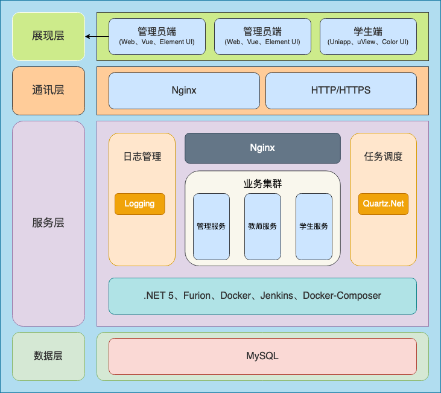
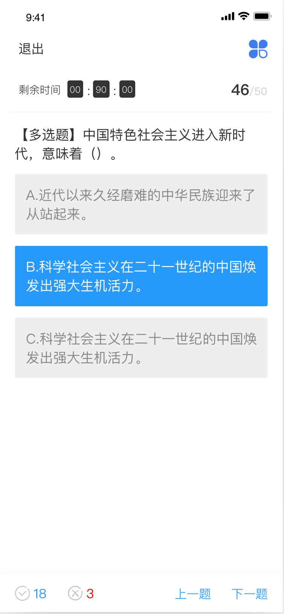
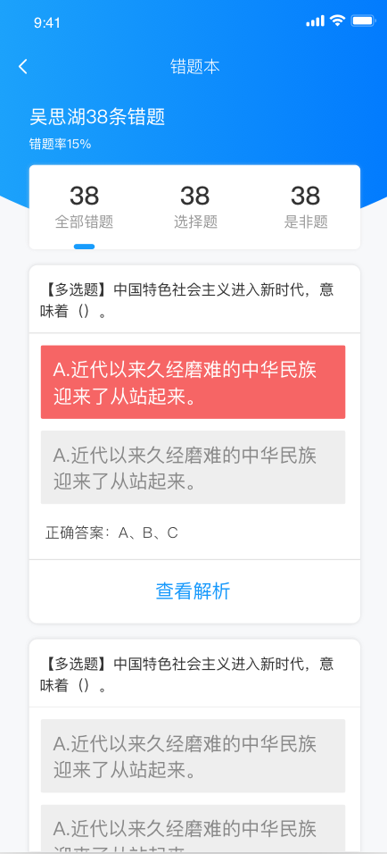

 
 
 
 
 

考试君 - 基于.NET 5语言的Furion框架开发在线考试系统

## 💐 架构

## 🥗 开发工具

- Uni-App
## 🍻 相关项目
- APP端：https://gitee.com/pig0224/ExamKing-app
- 后端：https://gitee.com/pig0224/ExamKing
- 管理员后台：https://gitee.com/pig0224/ExamKing-Admin
- 教师后台：https://gitee.com/pig0224/examking-teacher

## 🍿 运行
> 将config目录内的接口地址改成自己再运行即可

## 🍖 预览

## 🍻 贡献代码

`考试君` 遵循 `MIT` 开源协议，欢迎大家提交 `PR` 或 `Issue`。

如果要为项目做出贡献，请查看贡献指南。

## 🍚 关于作者

一个在校大学生，热爱编程、热爱代码。

## 🧆 友情链接

👉 **[Furion](https://gitee.com/monksoul/Furion)** 
👉 **[Vuejs](https://cn.vuejs.org/)** 
👉 **[Element UI](https://element.eleme.cn/)** 
👉 **[uView](https://uviewui.com/)** 
👉 **[ColorUI](https://www.color-ui.com/)** 

